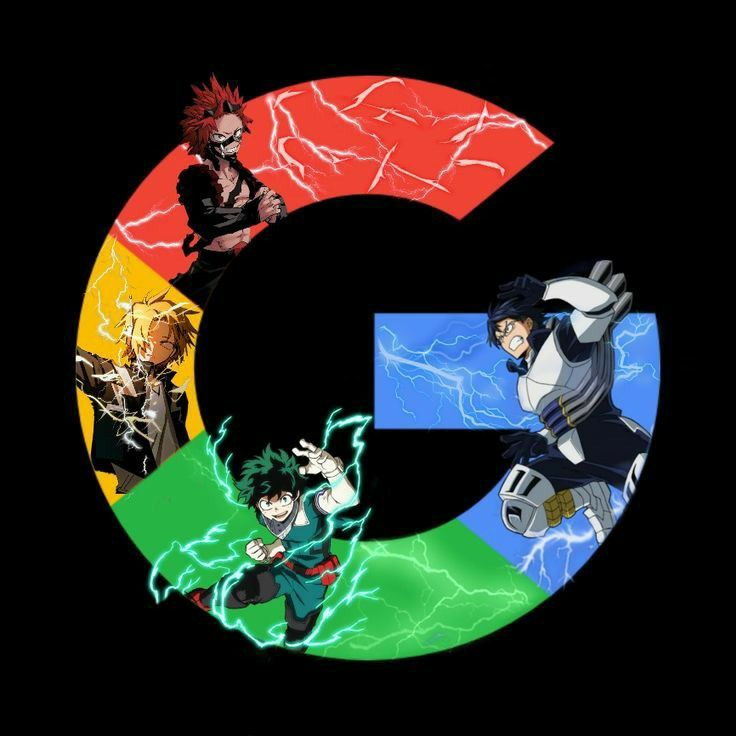

<!DOCTYPE HTML>
<html> 
<head>
    <title>AnimeWorld</title>
    <header>
        

            

                
                
AnimeWorld

            

            <nav>
                <ul class="nav-menu">
                    <li><a href="#">Home</a></li>
                    <li><a href="#">About</a></li>
                    <li><a href="#">Services</a></li>
                    <li><a href="#">Contact</a></li>
                    

                        <input type="text" placeholder="Search...">
                        <button type="submit">Search</button>
                    

                </ul>
            </nav>
        

    </header>

    
    <link rel="icon" href="Catch 'Em All in Style_ Official Ash Ketchum Costume with Jacket and Hat.jpeg" type="image/png">
    <link rel="stylesheet" href="style.css">
</head>
<body>
    <table><tr><th>Hentai</th><th>Anime</th><th>Manga</th></tr><tr>Ane wa yanmama</tr><tr>One pice<tr>Narutobs</tr></table>
   
    
   
    
    
     

    <h2>
<b>Recently updated</b>
</h2>
    
    
    
    
     
          
    

        <form class="form-box" action="/submit" method="post">
            <h3>Enter the AnimeWorld</h3>
            <label for="name">Name:</label>
            <input type="text" id="name" name="name" placeholder="Enter your name">
            
            <label for="email">Email:</label>
            <input type="email" id="email" name="email" placeholder="Enter your email">
            
            <label for="tel">Phone:</label>
            <input type="tel" id="phone" name="phone" placeholder="Enter your phone number">
            
            <input type="submit" value="Sign up">
            <u>Already have an account?</u><input type="submit" value="Login">
        </form>
    

    
          
    
    <footer>
        

            

                
            

            

                <h3>About Us</h3>
                
AnimeWorld is your ultimate destination for all things anime. Watch your favorite shows, read reviews, and stay updated with the latest news.

            

            

                <h3>Quick Links</h3>
                <ul>
                    <li><a href="#">Home</a></li>
                    <li><a href="#">About</a></li>
                    <li><a href="#">Services</a></li>
                    <li><a href="#">Contact</a></li>
                </ul>
            

            

                <a href="https://web.facebook.com/"><i class="fa fa-facebook"></i></a>
                <a href="https://web.facebook.com/"><i class="fa fa-twitter"></i></a>
                <a href="https://www.youtube.com/watch?v=dQw4w9WgXcQ&ab_channel=RickAstley"><i class="fa fa-instagram"></i></a>
            

            
        

        

            &copy; 2024 AnimeWorld. All rights reserved.
        

    </footer>
</body>
</html>
